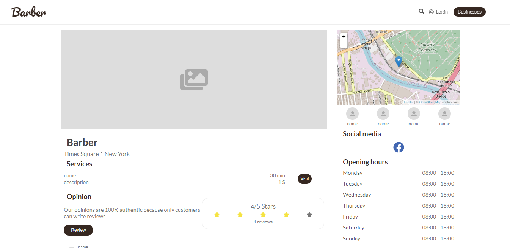

# Barber React App
Simple web app created with React. Backend made in Spring Boot: https://github.com/Tomek-dev/Barber


## Setup
Open project directory and type the following command to install the dependencies and start the application

```
npm install && npm start
```

Open http://localhost:3000 to view it in the browser.
